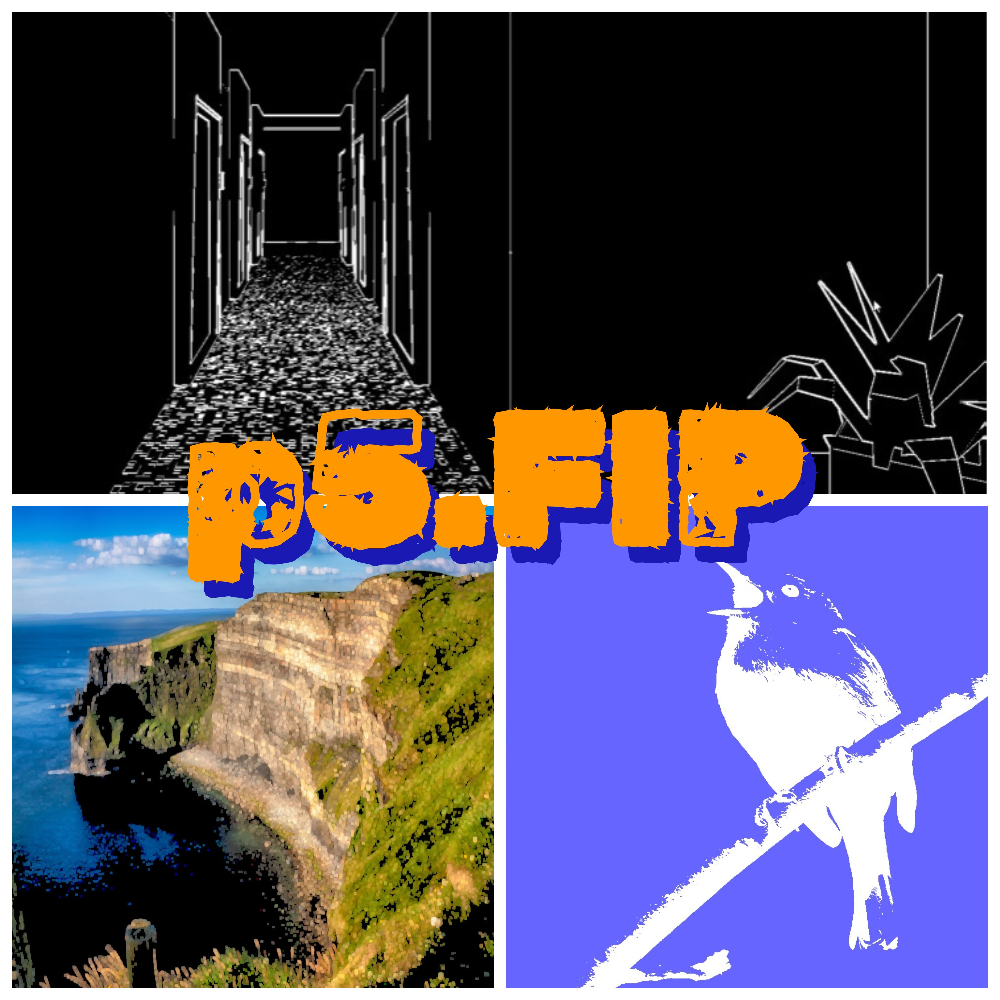

## p5.FIP (Fast Image Processing)
> Real-time image processing library for [p5.js](https://p5js.org/).

## What is it?
p5.FIP is a library that allows you to add image processing/post-processing effects to your p5.js sketch. In 5 lines of code you can add effects like bloom, glitching, cartoon shading and many more.


<div style="display: flex; justify-content: center">
        <div>
        
        </div>
</div>

## Features
- 44 Effects
- Hardware Accelerated
- Documented

## Getting Started

To use p5.FIP you can include it in your index.html file:
```html
    <head>
    <!-- ...-->
    <script src="https://prontopablo.github.io/p5.FIP/assets/javascripts/p5.FIP.js"></script>
    <!-- ...-->
    </head>
```
Alternatively you can download the p5.FIP.js file from [releases](https://github.com/prontopablo/p5.FIP/releases) and bring it into your project files:
``` html
    <head>
    <!-- ...-->
    <script src="p5.FIP.js"></script>
    <!-- ...-->
    </head>
```

The reference website can be found [here](https://prontopablo.github.io/p5.FIP/).

## Examples
Example sketches can be found in this collection [here](https://editor.p5js.org/prontopablo/collections/MA4R8jvck) and they are also included in the [examples folder](https://github.com/prontopablo/p5.FIP/tree/main/examples) on GitHub.

## p5.js Library Guidelines
In accordance with the [p5.js library guidelines](https://github.com/processing/p5.js/blob/main/contributor_docs/creating_libraries.md):

1. p5.FIP has no dependencies.
3. [Examples](https://github.com/prontopablo/p5.FIP/tree/main/examples) are included.
4. p5.FIP is open source.
5. Keywords: _image-processing, post-processing, filters_.
6. Last update: 15/03/24.

## Contributing
I welcome contributions from the community to make p5.FIP better. If you have any suggestions, bug fixes, or new features to add, feel free to create a [pull request](https://github.com/prontopablo/p5.FIP/pulls).

## Acknowledgments
Many of these shaders were adapted from existing solutions in other programming languages, in these cases, the links to the original shaders or tutorials followed can be found at the top of each shader.

A list of existing Processing image processing libraries can be found [here](https://prontopablo.github.io/p5.FIP/resources).
