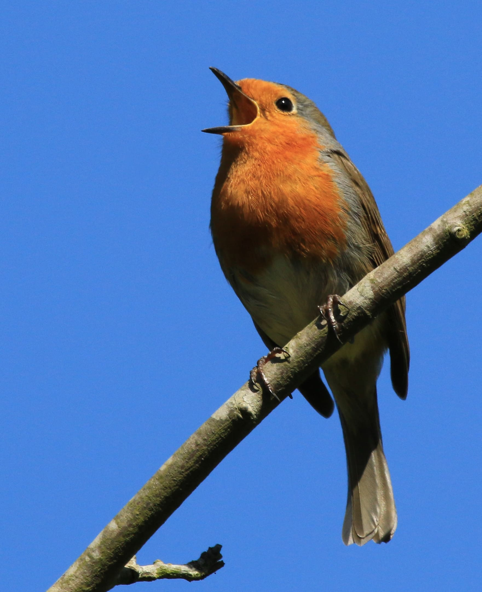
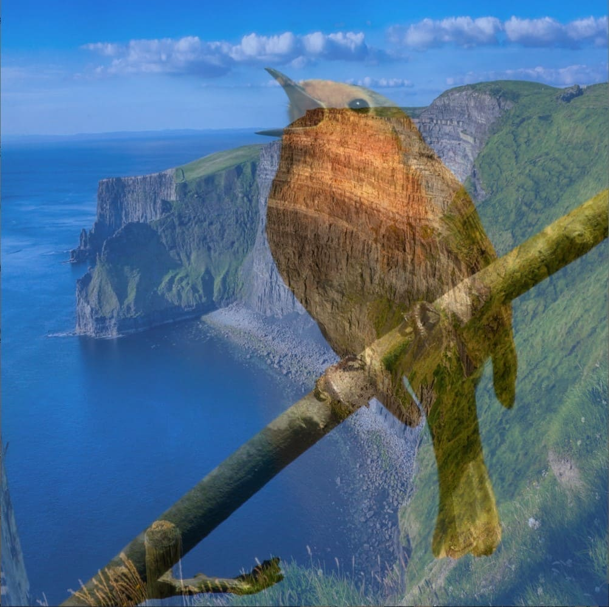

Blends textures together based on a mix factor and blending type.

## Parameters
`texture1` **Texture**: The first texture to be blended. Default: **`undefined`**
<br>
`texture2` **Texture**: The second texture to be blended. Default: **`undefined`**
<br>
`uTextureSize` **Vec2:** The size of the texture used for sampling neighboring pixels. Default: **`(0.0, 0.0)`**
<br>
`mixFactor` **Float**: How much weight to give each picture in the blending. A value of 0.0 only outputs texture1, 1.0 only outputs texture2. Default: **`0.0`**
<br>
`blendingMode` **Int**: Which blending mode to use. Below is a table of the values and their respective blend modes. Default: **`0.0`**

| blendingMode  | Blend Mode                  |
|---------------|-----------------------------|
| 1             | Additive Blending           |
| 2             | Subtract Blending           |
| 3             | Multiplicative Blending     |
| 4             | Screen Blending             |
| 5             | Overlay Blending            |
| 6             | Darken Blending             |
| 7             | Lighten Blending            |
| 8             | Difference Blending         |
| 9             | Exclusion Blending          |
| 10            | Behind Blending             |
| 11            | Dissolve Blending           |
| 12            | Hue Blending                |
| 13            | Normal Blending             |
| Default       | Linear Interpolation        |

## Example
```javascript hl_lines="34 35 36 37 38"
let layer1, layer2, ireland, bird, blend, blendingModeIndex = 0;

function setup() {
    createCanvas(600, 600, WEBGL); // Enable WEBGL mode for shaders
    
    blend = createFilterShader(fip.blend); // Load the blend shader
    
    ireland = loadImage("ireland.jpg");
    bird = loadImage("bird.jpg");
    
    // Create 2 framebuffers so we can control which textures are sent to the shaders
    layer1 = createFramebuffer();
    layer2 = createFramebuffer();
    
    console.log("Press any key to cycle through blending modes.");
}
  
function draw() {
    background(0);
    imageMode(CENTER);
  
    layer1.begin();
    image(ireland, 0, 0, width, height);
    layer1.end();

    layer2.begin();
    image(bird, 0, 0, width, height);
    layer2.end();
    
    // Apply the blend shader
    filter(blend);
    
    // Send our two textures to the shader
    blend.setUniform('texture1', layer1.color);
    blend.setUniform('texture2', layer2.color);
    blend.setUniform("uTextureSize", [width, height]);
    blend.setUniform('mixFactor', 0.5);
    blend.setUniform('blendingMode', blendingModeIndex);
}
  
function keyPressed() {
    // Cycle through blending modes when a key is pressed
    blendingModeIndex = (blendingModeIndex + 1) % 14; // 14 types of blending
    console.log("Blending Mode: " + blendingModeIndex);
}
```

<div style="display: flex;">
    <div style="margin-right: 20px">
        
        
        <figcaption>Images to be blended</figcaption>
    </div>
    <div>
        
        <figcaption>Blended image</figcaption>
    </div>
</div>