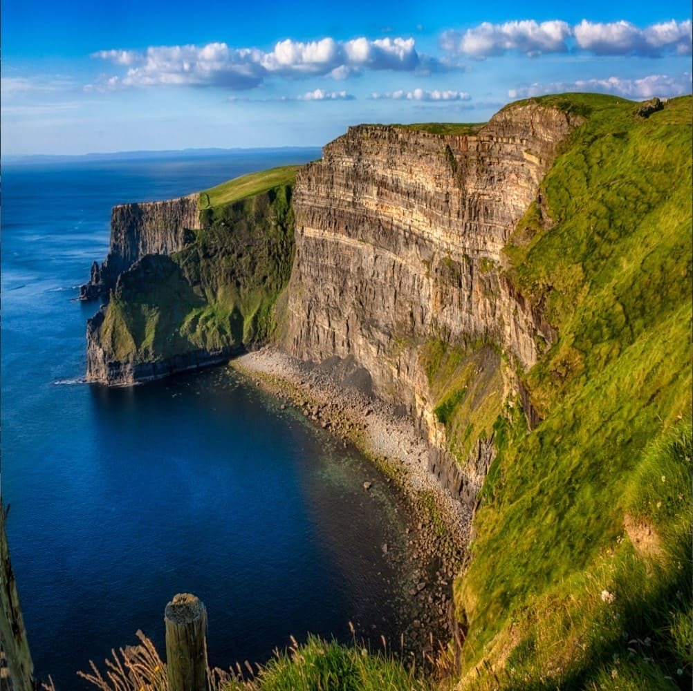

Blends textures together based on a mix factor and blending type.

## Parameters
`texture1` **Texture**: The first texture to be blended. Default: **`undefined`**
<br>
`texture2` **Texture**: The second texture to be blended. Default: **`undefined`**
<br>
`textureSize` **Vec2:** The size of the texture used for sampling neighboring pixels. Default: **`(0.0, 0.0)`**
<br>
`mixFactor` **Float**: How much weight to give each picture in the blending. A value of 0.0 only outputs texture1, 1.0 only outputs texture2. Default: **`0.5`**
<br>
`blendingMode` **Int**: Which blending mode to use. Below is a table of the values and their respective blend modes. Default: **`1.0`**

| blendingMode  | Blend Mode                  |
|---------------|-----------------------------|
| 1             | Additive Blending           |
| 2             | Subtract Blending           |
| 3             | Multiplicative Blending     |
| 4             | Screen Blending             |
| 5             | Overlay Blending            |
| 6             | Darken Blending             |
| 7             | Lighten Blending            |
| 8             | Difference Blending         |
| 9             | Exclusion Blending          |
| 10            | Behind Blending             |
| 11            | Dissolve Blending           |
| 12            | Hue Blending                |
| 13            | Normal Blending             |
| Default       | Linear Interpolation        |

## Example
```javascript
let layer,
  bird,
  ireland,
  blend;

function preload() {
    blend = createShader(fip.defaultVert, fip.blend); // Load the shader
    bird = loadImage("bird.jpg");
    ireland = loadImage("ireland.jpg");
}

function setup() {
    createCanvas(600, 600, WEBGL); // Use WEBGL mode to use the shader
    layer1 = createFramebuffer(); // Create framebuffers to draw the image onto (faster p5.js version of createGraphics())
    layer2 = createFramebuffer(); 
}
  
function draw() {
    background(0);
    
    // Create a framebuffer for blending
    layer1.begin();
    clear();
    lights();
    scale(1, -1);
    image(images[0], -width / 2, -height / 2, width, height);
    layer1.end();
    
    // Create a second framebuffer for blending
    layer2.begin();
    clear();
    lights();
    scale(1, -1);
    image(images[1], -width / 2, -height / 2, width, height);
    layer2.end();
    
    // Apply the shader
    shader(blend);
    
    // Set the shader uniforms
    blend.setUniform("texture1", layer1.color); // First texture
    blend.setUniform("texture2", layer2.color); // Second texture
    blend.setUniform('uTextureSize', [width, height]); // Set the size of the texture used
    blend.setUniform('mixFactor', 0.5);
    blend.setUniform('blendingMode', 0);

    rect(0, 0, width, height); // Draw a rectangle to apply the shader to
    resetShader(); 
}
```

<div style="display: flex;">
    <div style="margin-right: 20px">
        
        
        <figcaption>Images to be blended</figcaption>
    </div>
    <div>
        
        <figcaption>Blended image</figcaption>
    </div>
</div>