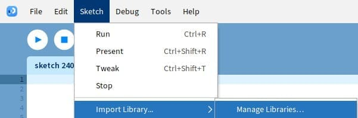

# Installation

## Option 1: Install with Processing Contribution Manager
The library is currently being reviewed by Processing Org, once it has been accepted it will be available from the Processing Contribution Manager

<figcaption>The Processing Contribution Manager can be found in Sketch > Import Library > Manage Libraries</figcaption>

## Option 2: Install Manually
[Download](https://github.com/prontopablo/FIP/releases/tag/latest) and then unzip FIP. Then put the extracted folder into the "libraries" folder of Processing.