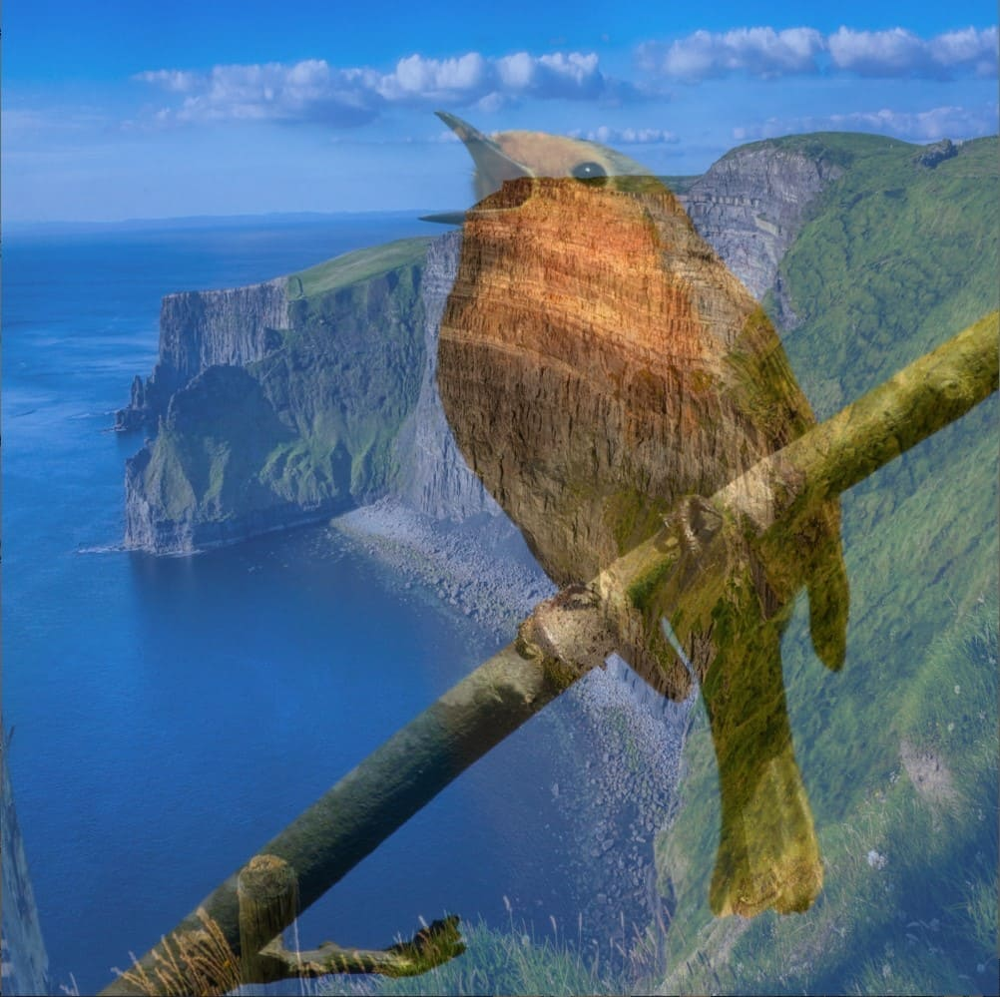

# Issues
Below are some common issues people have when using p5.FIP and how to resolve them. If your issue is not listed below, please report it [here](https://github.com/prontopablo/p5.FIP/issues) and I'll try to help you or fix it.

## Out of date graphics drivers
As p5.FIP runs GLSL shaders on the GPU, make sure you update to the latest graphics drivers for your GPU ([how?](https://www.youtube.com/watch?v=NBiJSPd_K4g)), otherwise you may see some visual glitches.

## Not passing textures
Some shaders have required parameters and will not work if these parameters are not passed into them. Below we use the _blend_ shader but fail to pass it the textures we want to blend, so it does nothing.

```javascript hl_lines="31 32 33"
let layer1, layer2, ireland, bird, blend, blendingModeIndex = 0;

function setup() {
    createCanvas(600, 600, WEBGL);
    
    blend = createFilterShader(fip.blend);
    
    ireland = loadImage("ireland.jpg");
    bird = loadImage("bird.jpg");
    
    layer1 = createFramebuffer();
    layer2 = createFramebuffer();
    
    console.log("Press any key to cycle through blending modes.");
}
  
function draw() {
    background(0);
    imageMode(CENTER);
  
    layer1.begin();
    image(ireland, 0, 0, width, height);
    layer1.end();

    layer2.begin();
    image(bird, 0, 0, width, height);
    layer2.end();
    
    filter(blend);
    
    // We must send our two textures to the shader for blend to work!
    // blend.setUniform('texture1', layer1.color);
    // blend.setUniform('texture2', layer2.color);
    blend.setUniform("uTextureSize", [width, height]);
    blend.setUniform('mixFactor', 0.5);
    blend.setUniform('blendingMode', blendingModeIndex);
}
  
function keyPressed() {
    blendingModeIndex = (blendingModeIndex + 1) % 14;
    console.log("Blending Mode: " + blendingModeIndex);
}
```

<div style="display: flex;">
    <div style="margin-right: 5px;">
        
        <figcaption>Required parameters not set, shader does nothing </figcaption>
    </div>
    <div>
        
        <figcaption>Image when textures are passed</figcaption>
    </div>
</div>
