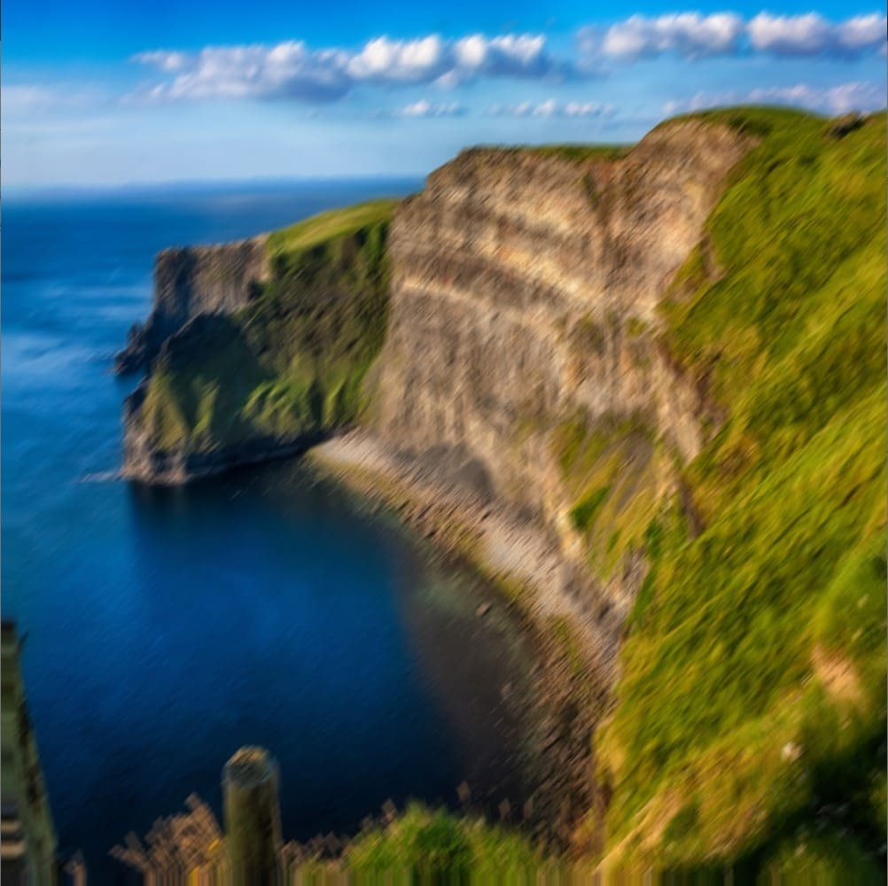
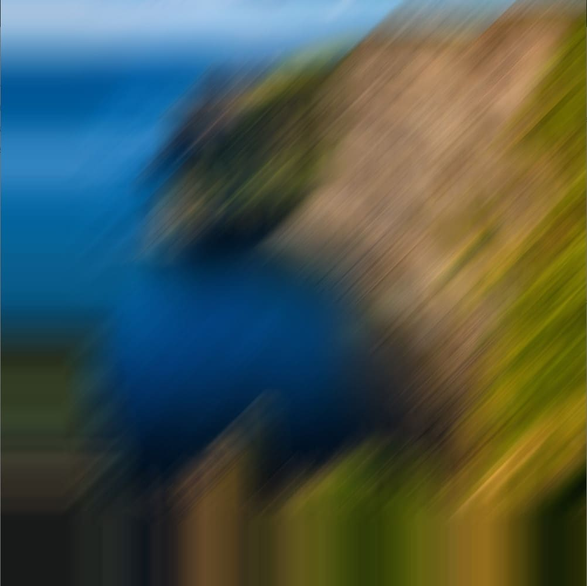

# Setting Parameters
Each effect has parameters that you can edit using _.set()_. The reference page for each effect lists the parameters and what they do.

The example below sets the blur amount of the motion blur shader to 100 (the default value is 10).
```java
import fip.*;

PShader motionBlur;
PImage ireland;

void setup() {
    size(1000, 1000, P3D);

    motionBlur = loadShader("motionBlur.glsl");
    
    motionBlur.set("blurAmount", 100.0); // Set the parameter named "blurAmount" to 100.
    
    ireland = loadImage("ireland.jpg");
}

void draw() {
    image(ireland, 0, 0, width, height); 

    filter(motionBlur);
}
```

<div style="display: flex;">
    <div style="margin-right: 5px;">
        
        <figcaption>blurAmount = 10</figcaption>
    </div>
    <div>
        
        <figcaption>blurAmount = 100</figcaption>
    </div>
</div>

