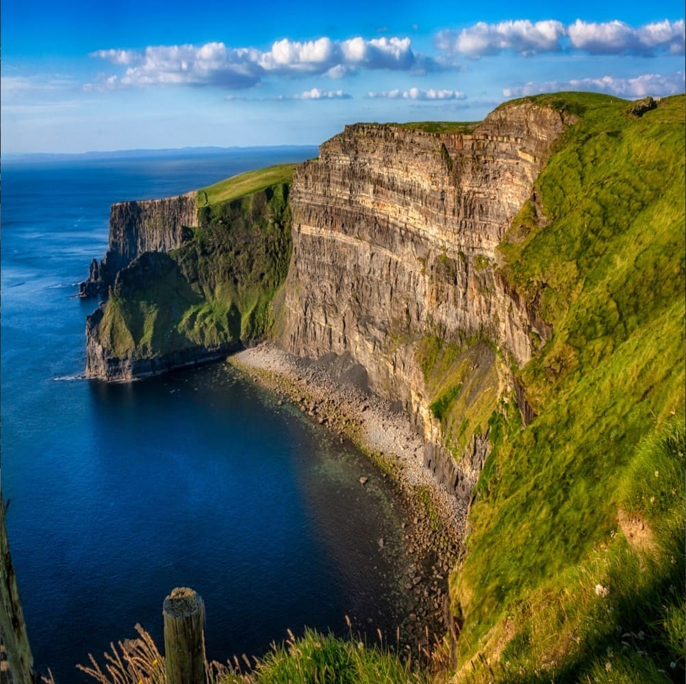
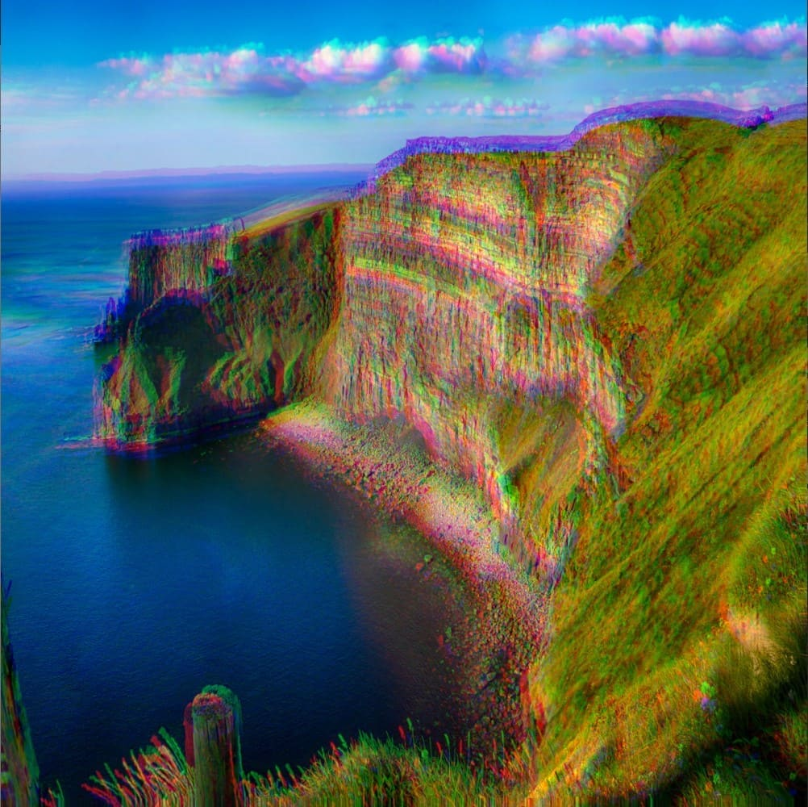

# Usage
Once p5.FIP has been included in your index.html file, to use an effect: 

1. In `createCanvas`, use the WEBGL renderer ([Why?](https://p5js.org/reference/#/p5/shader)).
2. Load the shader you want, using `createShader()`.
3. Call `shader()`, passing in the shader name.

```javascript
let layer,
  ireland,
  glitch;

function preload() {
    glitch = createShader(fip.defaultVert, fip.glitch); // Load the glitch shader
    ireland = loadImage("ireland.jpg");
}

function setup() {
    createCanvas(600, 600, WEBGL); // Use WEBGL mode to use the shader
    layer = createFramebuffer(); // Create a framebuffer to draw the image onto (faster p5.js version of createGraphics())
}
  
function draw() {
    background(0);
    
    // Draw an image to a framebuffer 
    layer.begin();
    clear();
    scale(1, -1); // Flip the Y-axis to match the canvas (different coordinate system in framebuffer)
    image(ireland, -width / 2, -height / 2, width, height);
    layer.end();
    
    // Apply the shader
    shader(glitch);
    
    // Set the shader uniforms
    glitch.setUniform('glitchIntensity', 0.8); // Set the intensity of the glitch effect
    glitch.setUniform("texture", layer.color); // Set the texture to apply the shader to

    rect(0, 0, width, height); // Draw a rectangle to apply the shader to
    resetShader(); 
}
```

<div style="display: flex;">
    <div style="margin-right: 5px;">
        
        <figcaption>Image with no effects</figcaption>
    </div>
    <div>
        
        <figcaption>Image with glitch effect applied</figcaption>
    </div>
</div>